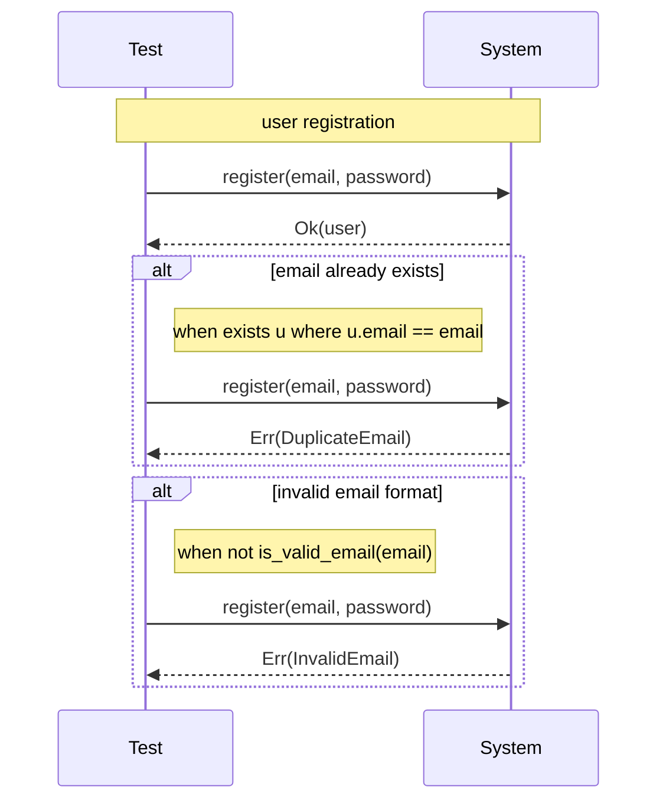

# Phase 9: Alternative Flows

## Overview

Extend scenarios to support alternative and exception flows, enabling complete specification of both happy paths and error cases. This brings use case-style coverage to Fastbreak's BDD scenarios.

### Goals

1. Specify error/exception paths alongside happy paths
2. Conditional alternatives based on state or input
3. Generate comprehensive test coverage documentation
4. Support scenario composition and reuse

### Non-Goals (for this phase)

- Automated test generation from alternatives
- Complex branching (nested alternatives)
- Scenario inheritance

---

## Language Design

### Syntax

Alternatives are defined within a scenario using `alt` blocks:

```fbs
scenario "user registration" {
    given {
        users = {}
        email = "alice@example.com"
    }
    when {
        result = register(email, "password123")
    }
    then {
        result is Ok
        users.len() == 1
    }

    alt "email already exists" when { exists u in users where u.email == email } {
        then {
            result is Err(DuplicateEmail)
            users' == users  // unchanged
        }
    }

    alt "invalid email format" when { not is_valid_email(email) } {
        then {
            result is Err(InvalidEmail)
            users' == users
        }
    }

    alt "weak password" when { password.len() < 8 } {
        then {
            result is Err(WeakPassword)
        }
    }
}
```

### Alternative Block Structure

```fbs
alt "<name>" [when { <condition> }] {
    [given { <additional_setup> }]
    [when { <different_action> }]
    then { <expected_outcome> }
}
```

| Component | Required | Description |
|-----------|----------|-------------|
| name | Yes | Descriptive name for the alternative |
| when condition | No | Condition that triggers this alternative |
| given | No | Additional setup (extends base given) |
| when | No | Different action (replaces base when) |
| then | Yes | Expected outcome for this path |

### Examples

#### Basic Error Handling

```fbs
scenario "withdraw funds" {
    given {
        account = Account { balance: 100 }
        amount = 50
    }
    when {
        result = withdraw(account, amount)
    }
    then {
        result is Ok
        account'.balance == 50
    }

    alt "insufficient funds" when { amount > account.balance } {
        then {
            result is Err(InsufficientFunds)
            account'.balance == account.balance
        }
    }

    alt "negative amount" when { amount < 0 } {
        then {
            result is Err(InvalidAmount)
        }
    }

    alt "account frozen" when { account.status == Frozen } {
        then {
            result is Err(AccountFrozen)
        }
    }
}
```

#### Alternative with Different Action

```fbs
scenario "user login" {
    given {
        user = User { email: "alice@example.com", password_hash: hash("correct") }
        sessions = {}
    }
    when {
        result = login("alice@example.com", "correct")
    }
    then {
        result is Ok
        sessions.len() == 1
    }

    alt "wrong password" {
        when {
            result = login("alice@example.com", "wrong")
        }
        then {
            result is Err(InvalidCredentials)
            sessions' == sessions
        }
    }

    alt "user not found" {
        when {
            result = login("nobody@example.com", "any")
        }
        then {
            result is Err(UserNotFound)
        }
    }

    alt "too many attempts" when { login_attempts >= 5 } {
        given {
            login_attempts = 5
        }
        then {
            result is Err(AccountLocked)
        }
    }
}
```

#### Extensions (Optional Behavior)

```fbs
scenario "checkout order" {
    given {
        cart = Cart { items: [item1, item2], total: 100 }
    }
    when {
        result = checkout(cart, payment_info)
    }
    then {
        result is Ok
        order_created(result.unwrap())
    }

    // Extension: optional coupon application
    alt "with valid coupon" {
        given {
            coupon = Coupon { code: "SAVE10", discount: 10 }
        }
        when {
            result = checkout(cart, payment_info, coupon)
        }
        then {
            result is Ok
            result.unwrap().total == 90
        }
    }

    // Extension: gift wrapping
    alt "with gift wrap" {
        when {
            result = checkout(cart, payment_info, gift_wrap: true)
        }
        then {
            result is Ok
            result.unwrap().has_gift_wrap
        }
    }
}
```

---

## AST Changes

### New: Alternative

```rust
// src/ast/scenario.rs

/// An alternative flow within a scenario
#[derive(Debug, Clone, PartialEq)]
pub struct Alternative {
    /// Name of the alternative
    pub name: SmolStr,
    /// Condition that triggers this alternative (optional)
    pub condition: Option<Expr>,
    /// Additional given bindings (optional, extends base)
    pub given: Option<GivenClause>,
    /// Different when clause (optional, replaces base)
    pub when: Option<WhenClause>,
    /// Expected outcome (required)
    pub then: ThenClause,
    /// Attributes on this alternative
    pub attributes: Vec<Attribute>,
    /// Span of the alternative
    pub span: Span,
}
```

### Modified: Scenario

```rust
pub struct Scenario {
    /// Scenario name
    pub name: SmolStr,
    /// Given clause
    pub given: GivenClause,
    /// When clause
    pub when: WhenClause,
    /// Then clause
    pub then: ThenClause,
    /// Alternative flows                    // NEW
    pub alternatives: Vec<Alternative>,
    /// Attributes
    pub attributes: Vec<Attribute>,
    /// Span of the entire scenario
    pub span: Span,
}
```

---

## Lexer Changes

### New Token: `alt`

```rust
// src/lexer/token.rs

/// `alt` keyword for alternative flows
#[token("alt")]
Alt,
```

---

## Parser Changes

### Modified: parse_scenario

```rust
fn parse_scenario(&mut self) -> ParseResult<Scenario> {
    let attributes = self.parse_attributes()?;
    let start = self.expect(&Token::Scenario)?;
    let name = self.parse_string()?;

    self.expect(&Token::LBrace)?;

    // Parse given
    self.expect(&Token::Given)?;
    let given = self.parse_given_clause()?;

    // Parse when
    self.expect(&Token::When)?;
    let when = self.parse_when_clause()?;

    // Parse then
    self.expect(&Token::Then)?;
    let then = self.parse_then_clause()?;

    // NEW: Parse alternatives
    let mut alternatives = Vec::new();
    while self.check(&Token::Alt) {
        alternatives.push(self.parse_alternative()?);
    }

    let end = self.expect(&Token::RBrace)?;

    Ok(Scenario {
        name,
        given,
        when,
        then,
        alternatives,
        attributes,
        span: start.merge(end),
    })
}
```

### New: parse_alternative

```rust
fn parse_alternative(&mut self) -> ParseResult<Alternative> {
    let attributes = self.parse_attributes()?;
    let start = self.expect(&Token::Alt)?;
    let name = self.parse_string()?;

    // Optional condition: `when { expr }`
    let condition = if self.check(&Token::When) && self.peek_is(&Token::LBrace) {
        self.advance(); // consume 'when'
        self.expect(&Token::LBrace)?;
        let expr = self.parse_expr()?;
        self.expect(&Token::RBrace)?;
        Some(expr)
    } else {
        None
    };

    self.expect(&Token::LBrace)?;

    // Optional given clause
    let given = if self.check(&Token::Given) {
        self.advance();
        Some(self.parse_given_clause()?)
    } else {
        None
    };

    // Optional when clause
    let when = if self.check(&Token::When) {
        self.advance();
        Some(self.parse_when_clause()?)
    } else {
        None
    };

    // Required then clause
    self.expect(&Token::Then)?;
    let then = self.parse_then_clause()?;

    let end = self.expect(&Token::RBrace)?;

    Ok(Alternative {
        name,
        condition,
        given,
        when,
        then,
        attributes,
        span: start.merge(end),
    })
}
```

---

## Semantic Analysis Changes

### Alternative Validation

```rust
fn analyze_scenario(&mut self, scenario: &Scenario) {
    // Analyze base scenario
    self.analyze_attributes(&scenario.attributes, AttributeContext::Scenario);

    let base_env = self.analyze_given(&scenario.given);
    self.with_env(&base_env, |analyzer| {
        analyzer.analyze_when(&scenario.when);
        analyzer.analyze_then(&scenario.then);
    });

    // Analyze alternatives
    for alt in &scenario.alternatives {
        self.analyze_alternative(alt, &base_env, scenario);
    }
}

fn analyze_alternative(
    &mut self,
    alt: &Alternative,
    base_env: &Environment,
    scenario: &Scenario,
) {
    self.analyze_attributes(&alt.attributes, AttributeContext::Alternative);

    // Condition must be boolean
    if let Some(ref cond) = alt.condition {
        let cond_type = self.analyze_expr_with_env(cond, base_env);
        if cond_type != Type::Bool {
            self.error(SemanticError::ConditionMustBeBool {
                found: cond_type,
                span: cond.span,
            });
        }
    }

    // Build alternative environment
    let mut alt_env = base_env.clone();

    // Additional given bindings extend base
    if let Some(ref given) = alt.given {
        let extra_bindings = self.analyze_given(given);
        alt_env.extend(extra_bindings);
    }

    self.with_env(&alt_env, |analyzer| {
        // When clause: use alternative's if present, else base
        let when = alt.when.as_ref().unwrap_or(&scenario.when);
        analyzer.analyze_when(when);

        // Then clause: always from alternative
        analyzer.analyze_then(&alt.then);
    });
}
```

### Alternative-Specific Checks

```rust
fn check_alternative_completeness(&mut self, scenario: &Scenario) {
    // Warning: alternatives without conditions might overlap
    let unconditioned: Vec<_> = scenario.alternatives
        .iter()
        .filter(|a| a.condition.is_none() && a.when.is_none())
        .collect();

    if unconditioned.len() > 1 {
        self.warning(SemanticWarning::AmbiguousAlternatives {
            scenario: scenario.name.clone(),
            alternatives: unconditioned.iter().map(|a| a.name.clone()).collect(),
        });
    }
}
```

---

## Model Changes

### New: CompiledAlternative

```rust
pub struct CompiledAlternative {
    pub name: SmolStr,
    pub condition: Option<CompiledExpr>,
    pub given: Option<Vec<CompiledBinding>>,
    pub when: Option<CompiledWhen>,
    pub then: CompiledThen,
    pub attributes: Vec<CompiledAttribute>,
}
```

### Modified: CompiledScenario

```rust
pub struct CompiledScenario {
    pub name: SmolStr,
    pub given: Vec<CompiledBinding>,
    pub when: CompiledWhen,
    pub then: CompiledThen,
    pub alternatives: Vec<CompiledAlternative>,  // NEW
    pub attributes: Vec<CompiledAttribute>,
}
```

---

## Codegen Changes

### Markdown Generator

```rust
fn generate_scenario(&self, scenario: &CompiledScenario) -> String {
    let mut output = format!("### Scenario: {}\n\n", scenario.name);

    // Base scenario
    output.push_str("**Given:**\n");
    for binding in &scenario.given {
        output.push_str(&format!("- `{}` = ...\n", binding.name));
    }

    output.push_str("\n**When:**\n");
    output.push_str(&format!("- {}\n", format_when(&scenario.when)));

    output.push_str("\n**Then:**\n");
    for assertion in &scenario.then.assertions {
        output.push_str(&format!("- {}\n", format_assertion(assertion)));
    }

    // Alternatives
    if !scenario.alternatives.is_empty() {
        output.push_str("\n#### Alternative Flows\n\n");

        for alt in &scenario.alternatives {
            output.push_str(&format!("##### {}\n\n", alt.name));

            if let Some(ref cond) = alt.condition {
                output.push_str(&format!("**Condition:** `{}`\n\n", format_expr(cond)));
            }

            if let Some(ref given) = alt.given {
                output.push_str("**Additional Setup:**\n");
                for binding in given {
                    output.push_str(&format!("- `{}` = ...\n", binding.name));
                }
                output.push_str("\n");
            }

            if let Some(ref when) = alt.when {
                output.push_str("**Different Action:**\n");
                output.push_str(&format!("- {}\n\n", format_when(when)));
            }

            output.push_str("**Expected:**\n");
            for assertion in &alt.then.assertions {
                output.push_str(&format!("- {}\n", format_assertion(assertion)));
            }
            output.push_str("\n");
        }
    }

    output
}
```

### Mermaid Sequence Diagram

Update to show alternative flows:

```rust
fn generate_sequence(&self, scenario: &CompiledScenario) -> String {
    let mut output = String::from("sequenceDiagram\n");
    output.push_str("    participant Test\n");
    output.push_str("    participant System\n\n");

    // Base flow
    output.push_str(&format!("    Note over Test,System: {}\n", scenario.name));
    output.push_str("    Test->>System: Execute action\n");
    output.push_str("    System-->>Test: Success\n");

    // Alternatives
    for alt in &scenario.alternatives {
        output.push_str(&format!("\n    alt {}\n", alt.name));
        if let Some(ref cond) = alt.condition {
            output.push_str(&format!("        Note right of Test: when {}\n", format_expr_short(cond)));
        }
        output.push_str("        Test->>System: Execute action\n");
        output.push_str(&format!("        System-->>Test: {}\n", summarize_then(&alt.then)));
        output.push_str("    end\n");
    }

    output
}
```

Example output:



---

## Testing Strategy

### Parser Tests

```rust
#[test]
fn test_parse_scenario_with_alternative() {
    let spec = parse(r#"
        scenario "test" {
            given { x = 1 }
            when { result = action(x) }
            then { result is Ok }

            alt "error case" when { x < 0 } {
                then { result is Err }
            }
        }
    "#).unwrap();

    assert_eq!(spec.scenarios.len(), 1);
    assert_eq!(spec.scenarios[0].alternatives.len(), 1);
}

#[test]
fn test_parse_alternative_with_different_when() {
    let spec = parse(r#"
        scenario "test" {
            given { x = 1 }
            when { result = action(x) }
            then { result is Ok }

            alt "different action" {
                when { result = other_action(x) }
                then { result is Ok }
            }
        }
    "#).unwrap();

    assert!(spec.scenarios[0].alternatives[0].when.is_some());
}

#[test]
fn test_parse_alternative_with_additional_given() {
    let spec = parse(r#"
        scenario "test" {
            given { x = 1 }
            when { result = action(x) }
            then { result is Ok }

            alt "with extra setup" {
                given { y = 2 }
                then { result.value == y }
            }
        }
    "#).unwrap();

    assert!(spec.scenarios[0].alternatives[0].given.is_some());
}
```

### Semantic Tests

```rust
#[test]
fn test_alternative_condition_must_be_bool() {
    let result = analyze(r#"
        scenario "test" {
            given { x = 1 }
            when { result = action(x) }
            then { result is Ok }

            alt "bad condition" when { x + 1 } {
                then { result is Err }
            }
        }
    "#);
    assert!(result.has_errors());
}

#[test]
fn test_alternative_inherits_base_given() {
    let result = analyze(r#"
        scenario "test" {
            given { x = 1 }
            when { result = action(x) }
            then { result is Ok }

            alt "uses x" when { x > 0 } {
                then { result.value == x }
            }
        }
    "#);
    // x should be accessible in alternative
    assert!(!result.has_errors());
}
```

---

## Implementation Order

### Step 1: AST and Lexer (0.5 unit)
- Add `alt` token
- Define `Alternative` struct
- Add `alternatives` field to `Scenario`

### Step 2: Parser (1 unit)
- Implement `parse_alternative`
- Modify `parse_scenario` to parse alternatives
- Handle optional condition, given, when clauses
- Write parser tests

### Step 3: Semantic Analysis (1 unit)
- Validate alternative conditions
- Handle environment inheritance
- Check for ambiguous alternatives (warning)
- Write semantic tests

### Step 4: Model Compilation (0.5 unit)
- Add `CompiledAlternative`
- Update `CompiledScenario`

### Step 5: Code Generation (1 unit)
- Update Markdown for alternative flows
- Update sequence diagrams with alt blocks
- Write codegen tests

---

## Future Work

1. **Nested Alternatives**: Alternatives within alternatives
2. **Scenario Composition**: `scenario X extends Y`
3. **Parameterized Scenarios**: Scenario outlines with example tables
4. **Coverage Analysis**: Which alternatives lack tests
